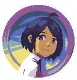

# Raya: A Space for The Unbound Starter Kit

## Overview

	

Raya is a starter kit framework intended to create a game like [A Space for The Unbound](https://www.togeproductions.com/project/a-space-for-the-unbound/ "A Space for The Unbound") by Mojiken Studio.
With this framework, you can create a game that share similarity like A Space for The Unbound easily without getting confused by the complexity of the game. This framework has several features such as:

- Modular and flexible dialogue system fit for non-programmer, thanks to [Fungus](https://fungusgames.com/ "Fungus").
- Immersive audio system, thanks to [FMOD](https://www.fmod.com/ "FMOD").
- Easily extend the features to your specific needs.

## Credits

- [DOTween](http://dotween.demigiant.com/ "DOTween")
- [FMOD](https://www.fmod.com/ "FMOD")
- [Fungus](https://fungusgames.com/ "Fungus")
- [Scene Loader](https://github.com/Home-Alone-Studios/unity-scene-loader "Scene Loader")

## Disclaimer

The assets (sprites, images, logo) that used in this project is the property and copyright of Mojiken Studio.
I do not claim to be the author of these assets.

The assets used in this project are only demo materials. I do not promote buying/selling or engaging in trading these assets illegally.
If you use this project, please replace all copyrighted assets. I am not responsible in the event of lawsuits for copyright infringement.
